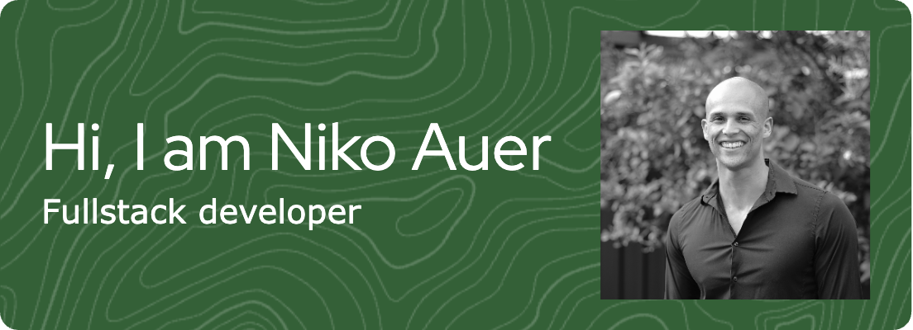

# Niko Auer 👋🏾

I'm a full-stack developer transitioning from a career in television broadcast and photography. I am passionate about programming and especially that satisfying uh-huh moment you get with all the problem solving that comes with developing a challenging project.

 - 📍 I live in Sydney, Australia.
 - 🧗🏽‍♂️ When I am not coding I am rock climbing or trying to be outdoors in nature hiking
 - 📸 I have worked in television and photography for over 9 years, which has seen me work on all manner of events. From local events like Tropfest all the way to the 2022 FIFA World Cup in Qatar.
 - My portfolio: https://niko-auer-portfolio.onrender.com

---

### 🧰 Languages and Tools

---

### 📈 Stats 
       
          
          
          
          
          
          
          
          
          
          
          
